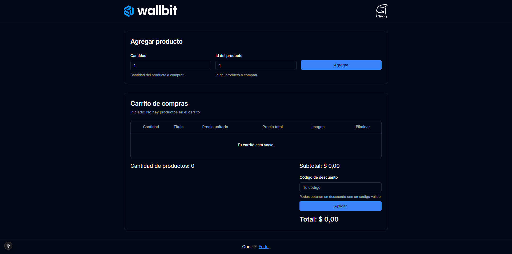
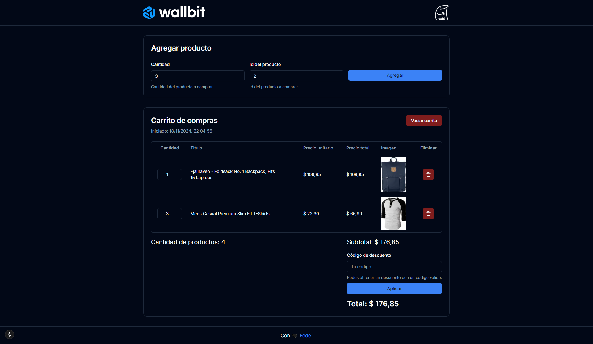
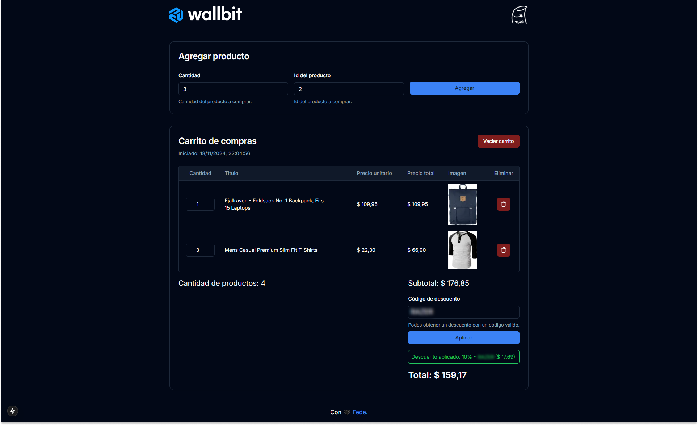

# Wallbit Junior Frontend Challenge

Challenge de carrito de compras para el stream de Goncy x Wallbit

## Tecnologías

- NextJS
- Typescript
- ShadCN
- TailwindCSS

## Funcionalidades

- Agregar/eliminar productos del carrito
- Cupones de descuento
- Persistencia en recarga
- Fecha de creación del carrito
- Ver el costo total del carrito
- Toast con diferentes alertas
- Skeleton para estado de carga

## Screenshots



> Carrito vacío



> Carrito con productos



> Con descuento aplicado

## Instalación

1. Clonar el repositorio

```bash
  git clone https://github.com/FedericoLuna01/wallbit-challenge.git
```

2. Entrar en la carpeta creada

```bash
  cd wallbit-challenge
```

3. Instalar las dependencias

```bash
  npm i
```

4. Correr el proyecto

```bash
  npm run dev
```

## Demo

[Ver demo](https://wallbit-challenge-pi.vercel.app/)

## Autor

- [@FedericoLuna01](https://www.github.com/federicoluna01)
